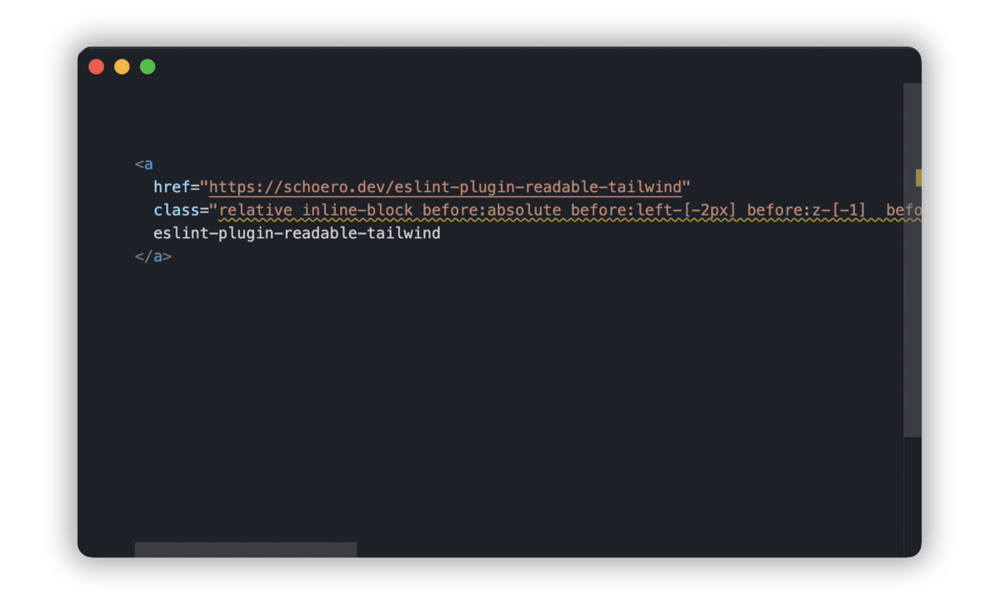

<div align="center">
  <picture>
    <source media="(prefers-color-scheme: dark)" srcset="./assets/eslint-plugin-readable-tailwind-logo-dark.svg">
    <source media="(prefers-color-scheme: light)" srcset="./assets/eslint-plugin-readable-tailwind-logo-light.svg">
    
  </picture>
</div>

<h1 align="center">readable-tailwind</h1>

<br/>
<br/>

<div align="center">
  <a alt="GitHub license" href="https://github.com/schoero/eslint-plugin-readable-tailwind/blob/main/LICENSE">
    <picture>
      <source media="(prefers-color-scheme: dark)" srcset="https://img.shields.io/github/license/schoero/eslint-plugin-readable-tailwind?style=flat-square&labelColor=32363B&color=ffffff">
      <source media="(prefers-color-scheme: light)" srcset="https://img.shields.io/github/license/schoero/eslint-plugin-readable-tailwind?style=flat-square&labelColor=EBEEF2&color=000000">
      
    </picture>
  </a>
  <a alt="npm version" href="https://www.npmjs.com/package/eslint-plugin-readable-tailwind?activeTab=versions">
    <picture>
      <source media="(prefers-color-scheme: dark)" srcset="https://img.shields.io/npm/v/eslint-plugin-readable-tailwind?style=flat-square&labelColor=32363B&color=ffffff">
      <source media="(prefers-color-scheme: light)" srcset="https://img.shields.io/npm/v/eslint-plugin-readable-tailwind?style=flat-square&labelColor=EBEEF2&color=000000">
      
    </picture>
  </a>
  <a alt="GitHub issues" href="https://github.com/schoero/eslint-plugin-readable-tailwind/issues">
    <picture>
      <source media="(prefers-color-scheme: dark)" srcset="https://img.shields.io/github/issues/schoero/eslint-plugin-readable-tailwind?style=flat-square&labelColor=32363B&color=ffffff">
      <source media="(prefers-color-scheme: light)" srcset="https://img.shields.io/github/issues/schoero/eslint-plugin-readable-tailwind?style=flat-square&labelColor=EBEEF2&color=000000">
      
    </picture>
  </a>
  <a alt="npm total downloads" href="https://www.npmjs.com/package/eslint-plugin-readable-tailwind?activeTab=readme">
    <picture>
      <source media="(prefers-color-scheme: dark)" srcset="https://img.shields.io/npm/dt/eslint-plugin-readable-tailwind?style=flat-square&labelColor=32363B&color=ffffff">
      <source media="(prefers-color-scheme: light)" srcset="https://img.shields.io/npm/dt/eslint-plugin-readable-tailwind?style=flat-square&labelColor=EBEEF2&color=000000">
      
    </picture>
  </a>
  <a alt="GitHub repo stars" href="https://github.com/schoero/eslint-plugin-readable-tailwind/stargazers">
    <picture>
      <source media="(prefers-color-scheme: dark)" srcset="https://img.shields.io/github/stars/schoero/eslint-plugin-readable-tailwind?style=flat-square&labelColor=32363B&color=ffffff">
      <source media="(prefers-color-scheme: light)" srcset="https://img.shields.io/github/stars/schoero/eslint-plugin-readable-tailwind?style=flat-square&labelColor=EBEEF2&color=000000">
      
    </picture>
  </a>
  <a alt="GitHub workflow status" href="https://github.com/schoero/eslint-plugin-readable-tailwind/actions?query=workflow%3ACI">
    <picture>
      <source media="(prefers-color-scheme: dark)" srcset="https://img.shields.io/github/actions/workflow/status/schoero/eslint-plugin-readable-tailwind/ci.yml?event=push&style=flat-square&labelColor=32363B&color=ffffff">
      <source media="(prefers-color-scheme: light)" srcset="https://img.shields.io/github/actions/workflow/status/schoero/eslint-plugin-readable-tailwind/ci.yml?event=push&style=flat-square&labelColor=EBEEF2&color=000000">
      
    </picture>
  </a>
</div>

<br/>
<br/>

ESLint plugin to automatically break up long tailwind class strings into multiple lines based on a specified print width or class count. This improves readability and eliminates horizontal scrolling.  
It also sorts the classes logically, removes unnecessary whitespaces and groups the classes by their modifiers. It works in jsx, svelte, vue, and html files.

<br/>
<br/>

<div align="center">
  
</div>

<br/>
<br/>

<div align="center">

  <a href="https://github.com/sponsors/schoero">
    <picture>
      <source media="(prefers-color-scheme: dark)" srcset="./assets/sponsor-dark.svg">
      <source media="(prefers-color-scheme: light)" srcset="./assets/sponsor-light.svg">
      
    </picture>
  </a>
  
  This project is financed by the community.  
  If you or your company benefit from this project, please consider becoming a sponsor or making a one-time donation.  
  Your contribution will help me to maintain and develop the project.

</div>

<br/>
<br/>

## Installation

```sh
npm i -D eslint-plugin-readable-tailwind
```

<br/>

## Quick start

1. Check out the [Parsers](#parsers) section below to see how to configure the plugin for your specific flavor.
1. Read the [Rules](#rules) section to learn about the available rules and how to configure them.
1. Read the [Utilities](#utilities) section to see which tailwind utilities are supported out of the box and how to extend the default configuration.
1. Configure your editor to conveniently [auto-fix on save](#auto-fix-on-save).

<br/>
<br/>

### Parsers

Depending on the flavor you are using, you may need to install and configure the corresponding parser:

- [JavaScript](docs/parsers/javascript.md)
- [TypeScript](docs/parsers/typescript.md)
- [JSX](docs/parsers/jsx.md)
- [TSX](docs/parsers/tsx.md)
- [Svelte](docs/parsers/svelte.md)
- [Vue](docs/parsers/vue.md)
- [HTML](docs/parsers/html.md)

<br/>
<br/>

### Rules

| Name | Description | `error` | `warning` | autofix |
| :--- | :--- | :---: | :---: | :---: |
| [multiline](docs/rules/multiline.md) | Enforce consistent line wrapping for tailwind classes. | ✔ | ✔ | ✔ |
| [no-unnecessary-whitespace](docs/rules/no-unnecessary-whitespace.md) | Disallow unnecessary whitespace in tailwind classes. | ✔ | ✔ | ✔ |
| [sort-classes](docs/rules/sort-classes.md) | Enforce a consistent order for tailwind classes. | ✔ | ✔ | ✔ |
| [no-duplicate-classes](docs/rules/no-duplicate-classes.md) | Remove duplicate classes. |   |   | ✔ |

<br/>
<br/>

### Utilities

This plugin works out of the box with most popular tailwind utilities:

- [tailwind merge](https://github.com/dcastil/tailwind-merge)
- [class variance authority](https://github.com/joe-bell/cva)
- [tailwind variants](https://github.com/nextui-org/tailwind-variants?tab=readme-ov-file)
- [shadcn](https://ui.shadcn.com/docs/installation/manual)
- [classcat](https://github.com/jorgebucaran/classcat)
- [class list builder](https://github.com/crswll/clb)
- [clsx](https://github.com/lukeed/clsx)
- [cnbuilder](https://github.com/xobotyi/cnbuilder)
- [classnames template literals](https://github.com/netlify/classnames-template-literals)
- [obj str](https://github.com/lukeed/obj-str)

<br/>
<br/>

In case an utility is not supported or you have built your own, you can change which literals will get linted for each rule.
Read the [API documentation](./docs/api/defaults.md) to learn how to override or extend the default config.

<br/>
<br/>

### Editor configuration

#### VSCode

##### Auto-fix on save

These rules are intended to automatically fix the tailwind classes. If you have installed the [VSCode ESLint plugin](https://marketplace.visualstudio.com/items?itemName=dbaeumer.vscode-eslint), you can configure it to automatically fix the classes on save by adding the following options to your `.vscode/settings.json`:

```jsonc
{
  // enable ESLint to fix tailwind classes on save
  "editor.codeActionsOnSave": {
    "source.fixAll.eslint": "explicit"
  }
}
```

<br/>
<br/>
